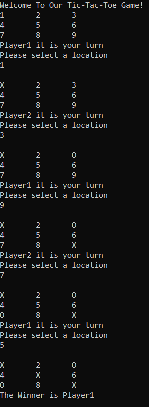

# tic-tac-toe-lab04
## Summary
This is a Tic-Tac-Toe game that enables two players to compete with each other, switch turns and when it’s done it returns the winner.

## Classes & Methods
There are four main classes in this game app:

1.	Board: it has the Game board in it which is a 2d array. And it has a method to display the Game board that is called DisplayBoard.

2.	Position: it consists of two properties of type integer and they are: Row and Column.

3.	Game: this class has four properties: Player1, player2, Winner and Board. It has a method called Play that calls several methos in a specific order to play the game. First, it displays the Game board then determines the next player, then it prints whose turn is now and ask the player to pick a location, then it checks if there is a winner and finally switch the turns and display the board one last time.

4.	Player: it consists of three properties: Name, Marker and Isturn. It has three methods:

-	GetPosition
-	PositionForNumber
-	TakeTurn

## Languages
This app was written using c#

## Demo

## Game Instructions 

1. Player1 is X, Player 2 is O.
2. The player should input a number from 1 to 9 in order to write O or X.
3. At the end of the game, it will print out the name of the winner or in case of a tie it will print it's a tie. 

